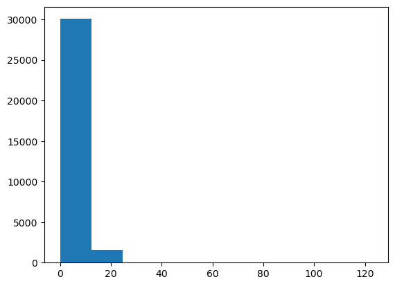
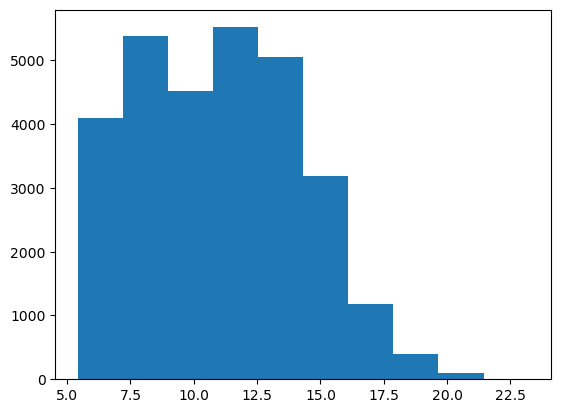
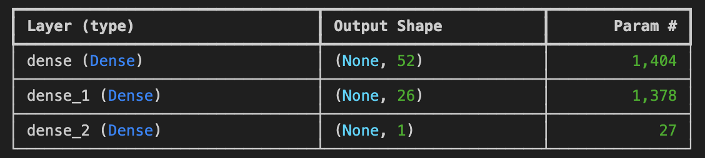

# Loan Eligibility Prediction
## Authors: Ruprekha Baruah, Vidushi Bundhooa, Saba Alaeddini
## Overview 
This project aims to **train and evaluate a machine learning model** to classify loans as either **'approved' or 'not-approved'**, based on borrowers' **demographic and financial data**.

## Table of Contents
- [Instructions for Using the Project](#Instructions-for-Using-the-Project)
- [Data Source](#Data-Source)
- [Data Ethics](#Data-Ethics)
- [About Dataset](#About-Dataset)
- [Data Cleaning and Initial Exploration](#Data-Cleaning-and-Initial-Exploration)
- [Data Storage](#Data-Storage)
- [Credit Risk Prediction Dashboard](#Credit-Risk-Prediction-Dashboard)
- [Machine Learning Models](#Machine-Learning-Models)
- [Conclusion](#Conclusion)
- [Technologies Used](#Technologies-Used)

## Instructions for Using the Project
1. Clone the Repository: git clone 
https://github.com/ruprekhab/Loan-Eligibility.git

2. Set Up the Environment:

Install the required Python libraries: 

 pip install -r installed_packages.txt

Ensure PostgreSQL is installed and running. Import the database schema from schema.sql file and data using the CSV files in the output folder.

3. Run the Flask Application:

* Start the Flask server: python app2.py
* Ensure you have configured your database connection properly. Use your PostgreSQL password in the password field of your configuration
Access the API at http://localhost:5000/. 
View and interact with the Application: Open the index.html file in your web browser. Fill up the form and click "Predict Loan Eligibility".

## Data Sourse: 
The dataset for this project was sourced from **Kaggle**. It includes information on customer demographics and financial details.  
**Dataset Link:** [Credit Risk Dataset on Kaggle](https://www.kaggle.com/datasets/laotse/credit-risk-dataset)

## Data Ethics  
- The dataset was obtained from **Kaggle**, a reputable public dataset platform.  
- It **does not contain any personal or sensitive information**, ensuring privacy compliance.  
- Analysis was conducted to **prevent biases** and ensure fairness in loan classification.  

## About Dataset: 
A detailed breakdown of the dataset structure: 

## Data Cleaning and Initial Exploration

Before conducting analysis, we **cleaned the data** to ensure its quality and consistency. 

#### **1️⃣ Loading the Data**  
The dataset was read into a Pandas DataFrame.

#### **2️⃣ Handling Missing Values** 
* Checked for missing values using `data.isnull().sum()`.  
* Missing data distributions were analyzed for **'person_emp_length'** and **'loan_int_rate'**.  
* Since the data was skewed, rows with missing values were **removed**.

 Histogram for 'person_emp_length'

 Histogram for 'loan_int_rate'

#### **3️⃣ Handling Outliers**

**Age, income, loan amount, interest rate, and employment duration** were analyzed for outliers.  
Filter was applied to keep **age below 100** and **employment duration below 50 years**.  

<Boxplot detecting outliers>

#### **4️⃣ Saving Clean Data**  
The cleaned dataset was **saved as a CSV file** for further processing.  

## Data Storage  
To manage the cleaned data, we:  
Designed an **Entity-Relationship Diagram (ERD)** using **QuickDBD**.  
Created a **PostgreSQL database schema**.  
Loaded the cleaned data into **PostgreSQL** for structured querying and analysis.

## Credit Risk Prediction Dashboard
Objective: Identifying factors that influence loan defaults.

[🔗 View the Tableau Dashboard](https://public.tableau.com/app/profile/ruprekha.baruah/viz/Credit_Risk_17405893318310/Dashboard)

**Total Loan Applications:** 28,632

**Default Cases:** 5102

**Non-Default Cases:** 23,530

**Key Insights**
**Loan Purpose:** Majority of the loans were taken for **education**, followed by **medical expenses**. Loans for **home improvement** had the fewest borrowers (11%).  
**Credit History:** A **shorter credit history** is linked to **higher default rates**.  
**Interest Rates:** **Higher interest rates** correlate with **increased default risk**.  
**Employment & Homeownership:** Borrowers with **longer employment history and homeownership** tend to **default less**.  
**Loan Intent & Default Risk:** Loans taken for **educational purposes** show **higher default risks**.  
**Loan Grade:** **Grade C** had the **highest number of defaulters**.  

## Machine Learning Models:

#### Deep learning
* **Preprocess the data:**
    - Target variable (y): loan_status
    - Features variable (X): person_age, person_income, person_home_ownership, person_emp_length, loan_intent, loan_grade, loan_amnt, loan_int_rate, loan_status, loan_percent_income, cb_person_default_on_file, cb_preson_cred_hist_length.
    * **Encoding:** Used pd.get_dummies() for categorical variables.
    * **Splitting Data:** Used train_test_split() to split data into training and testing sets.

**Model 1: Initial Deep Learning Model**
**Architecture**

 * First Layer: 52 Neurons, Activation: ReLU
 * Second Layer: 26 Neurons, Activation: ReLU
 * Output Layer: 1 Neuron, Activation: Sigmoid

**Training & Evaluation**
 * Loss Function: Binary Crossentropy
 * Optimizer: Adam
 * Metrics: Accuracy
 * Epochs: 50
 
**Results:**
 * Accuracy: 92%
 * Loss: 25%

**Optimization 1: Add Additional Hidden Layer**

**Architecture**
 * First Layer: 52 Neurons, Activation: ReLU
 * Second Layer: 26 Neurons, Activation: ReLU
 * Third Layer: 13 Neurons, Activation: ReLU
 * Output Layer: 1 Neuron, Activation: Sigmoid

**Training & Evaluation**

 * Loss Function: Binary Crossentropy
 * Optimizer: Adam
 * Metrics: Accuracy
 * Epochs: 50

**Results:**
 * Accuracy: 91%
 * Loss: 27%

**Optimization 2: Increase epochs to 100**
**Architecture**

 * First Layer: 52 Neurons, Activation: ReLU
 * Second Layer: 26 Neurons, Activation: ReLU
 * Third Layer: 13 Neurons, Activation: ReLU
 * Output Layer: 1 Neuron, Activation: Sigmoid

**Training & Evaluation**

 * Loss Function: Binary Crossentropy
 * Optimizer: Adam
 * Metrics: Accuracy
 * Epochs: 100

**Results:**
 * Accuracy: 91%
 * Loss: 33%

#### Logistic Regression
#### Random Forest
#### XGBoost
## Conclusion
After evaluating multiple models, XGBoost was selected for the application due to its 94% accuracy—the highest among all tested models. While Random Forest performed comparably, XGBoost consistently outperformed it across most evaluation metrics. Additionally, XGBoost offers an optimal balance between high accuracy and interpretability, making it a practical choice. Its efficiency in execution further enhances its suitability for real-time applications, ensuring faster predictions without compromising performance.

## Technologies Used
**Languages:** Python, SQL, HTML, JavaScript

**Libraries/Packages:** Pandas, NumPy, SKLearn, Tensoreflow, Keras, Psycopg2, SQLAlchemy, Flask, Matplotlib, Seaborn, XGBoost, Joblib

**Database:** PostgreSQL

**Tools:** QuickDBD (for ERD design), Lucid Chart (for Block Diagram), CSV(for raw data storage and exchange)

