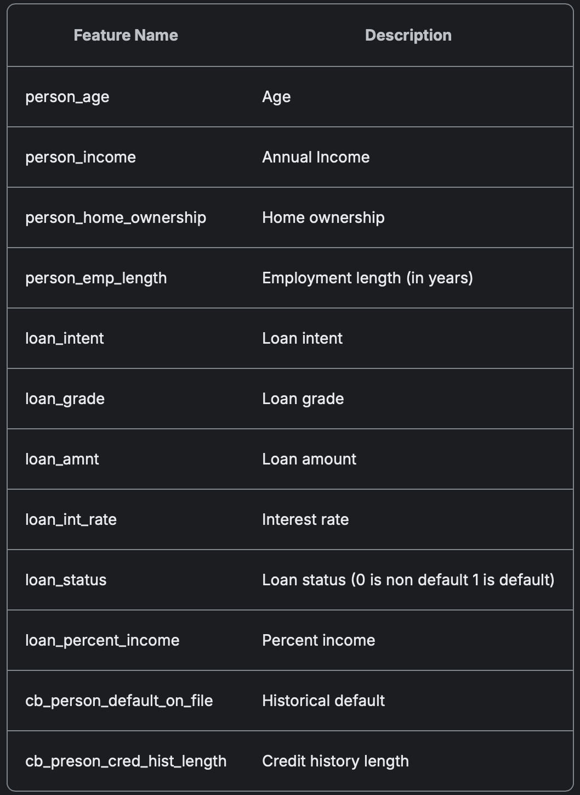
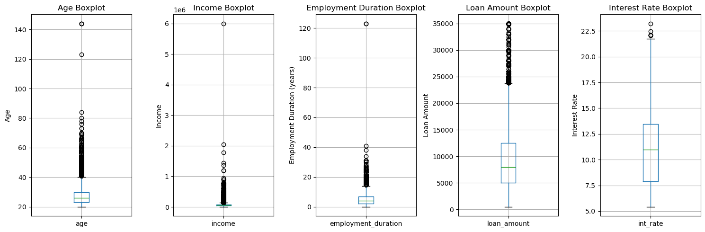
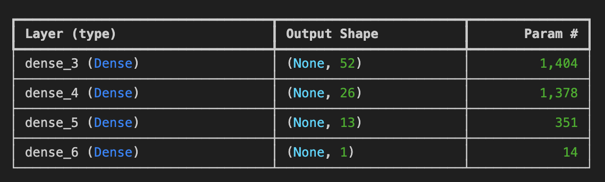

# Loan Eligibility Prediction
## Authors: Ruprekha Baruah, Vidushi Bundhooa, Saba Alaeddini
## Overview 
This project aims to **train and evaluate a machine learning model** to classify loans as either **'approved' or 'not-approved'**, based on borrowers' **demographic and financial data**.

## Table of Contents
- [Project Structure](#project-structure)
- [Instructions for Using the Project](#Instructions-for-Using-the-Project)
- [Data Source](#Data-Source)
- [Data Ethics](#Data-Ethics)
- [About Dataset](#About-Dataset)
- [Data Cleaning and Initial Exploration](#Data-Cleaning-and-Initial-Exploration)
- [Data Storage](#Data-Storage)
- [Credit Risk Prediction Dashboard](#Credit-Risk-Prediction-Dashboard)
- [Machine Learning Models](#Machine-Learning-Models)
- [Conclusion](#Conclusion)
- [Technologies Used](#Technologies-Used)

## Project Structure  

This repository contains all the necessary files and scripts for a loan eligibility prediction system using machine learning. Below is the structure of the project:  

* **all_models/**  
This folder contains scripts for various machine learning models, including:  
  - Deep Learning  
  - Logistic Regression  
  - Random Forest  
  - XGBoost  

* **app_files/**  
Contains files required for the web application and API:  
  - **App2.py** – API script for predicting loan eligibility using the trained XGBoost model.  
  - **feature_columns.pkl** – Stores feature column names in `.pkl` format, used to process user-inputted features.  
  - **xgboost_model.pkl** – Trained XGBoost model saved in `.pkl` format for making predictions.  
  - **index.html** – Webpage script where users input personal and financial details to predict loan eligibility.  

* **Images/** :Stores images.  

* **Resource/**/: Contains raw and cleaned CSV files used for data processing and analysis.  

* **data_cleaning.ipynb**: upyter Notebook for cleaning raw data and preparing it for analysis and model training.  

* **ERD.sql**: SQL schema used for setting up the PostgreSQL database.  

* **Installed_packages.txt**: List of required Python packages for the project. 

## Instructions for Using the Project
1. Clone the Repository: git clone 
https://github.com/ruprekhab/Loan-Eligibility.git

2. Set Up the Environment:

Run the following command to install dependencies:  
```bash  
pip install -r Installed_packages.txt 
```


Ensure PostgreSQL is installed and running. Import the database schema from schema.sql file and data using the CSV files in the output folder.

3. Run the Flask Application:

* Start the Flask server: python app2.py
* Ensure you have configured your database connection properly. Use your PostgreSQL password in the password field of your configuration
Access the API at http://localhost:5000/. 
<p>View and interact with the Application: Open the index.html file in your web browser. Fill up the form and click "Predict Loan Eligibility".

## Data Source: 
The dataset for this project was sourced from **Kaggle**. It includes information on customer demographics and financial details.  
**Dataset Link:** [Credit Risk Dataset on Kaggle](https://www.kaggle.com/datasets/laotse/credit-risk-dataset)

## Data Ethics  
- The dataset was obtained from **Kaggle**, a reputable public dataset platform.  
- It **does not contain any personal or sensitive information**, ensuring privacy compliance.  
- Analysis was conducted to **prevent biases** and ensure fairness in loan classification.  

## About Dataset: 
A detailed breakdown of the dataset structure: 



## Data Cleaning and Initial Exploration

Before conducting analysis, we **cleaned the data** to ensure its quality and consistency. 

#### **1️⃣ Loading the Data**  
The dataset was read into a Pandas DataFrame.

#### **2️⃣ Handling Missing Values** 
* Checked for missing values using `data.isnull().sum()`.  
* Missing data distributions were analyzed for **'person_emp_length'** and **'loan_int_rate'**.  
* Since the data was skewed, rows with missing values were **removed**.

<p> Histogram for 'person_emp_length'


<p> Histogram for 'loan_int_rate'


#### **3️⃣ Handling Outliers**

**Age, income, loan amount, interest rate, and employment duration** were analyzed for outliers.  
Filter was applied to keep **age below 100** and **employment duration below 50 years**.  

<Boxplot detecting outliers>



#### **4️⃣ Saving Clean Data**  
The cleaned dataset was **saved as a CSV file** for further processing.  


## Data Storage  
To manage the cleaned data, we:  
Designed an **Entity-Relationship Diagram (ERD)** using **QuickDBD**.  
Created a **PostgreSQL database schema**.  
Loaded the cleaned data into **PostgreSQL** for structured querying and analysis.

## Credit Risk Prediction Dashboard
Objective: Identifying factors that influence loan defaults.

[🔗 View the Tableau Dashboard](https://public.tableau.com/app/profile/ruprekha.baruah/viz/Credit_Risk_17405893318310/Dashboard)


**Total Loan Applications:** 28,632

**Default Cases:** 5102

**Non-Default Cases:** 23,530

**Key Insights**
 * **Loan Purpose:** Majority of the loans were taken for **education**, followed by **medical expenses**. Loans for **home improvement** had the fewest borrowers (11%).  
 * **Credit History:** A **shorter credit history** is linked to **higher default rates**.  
 * **Interest Rates:** **Higher interest rates** correlate with **increased default risk**.  
 * **Employment & Homeownership:** Borrowers with **longer employment history and homeownership** tend to **default less**.  
 * **Loan Intent & Default Risk:** Loans taken for **educational purposes** show **higher default risks**.  
 * **Loan Grade:** **Grade C** had the **highest number of defaulters**.  


## Machine Learning Models:
To test the machine learning models, data was retrieved from PostgreSQL using SQLAlchemy. 
* **Preprocess the data:**
    * Target variable (y): loan_status
    * Features variable (X): person_age, person_income, person_home_ownership, person_emp_length, loan_intent, loan_grade, loan_amnt, loan_int_rate, loan_status, loan_percent_income, cb_person_default_on_file, cb_preson_cred_hist_length.
    * **Encoding:** Used pd.get_dummies() for categorical variables.
    * **Splitting Data:** Used train_test_split() to split data into training and testing sets.
    * **Standard Scaler:** Features are scaled using StandardScaler to ensure the data is on a comparable scale. Standard Scaler was used for Deep Learning, Random Forest and Logistic Regression.

### Deep learning
  

**Model 1: Initial Deep Learning Model**
**Architecture**

 * First Layer: 52 Neurons, Activation: ReLU
 * Second Layer: 26 Neurons, Activation: ReLU
 * Output Layer: 1 Neuron, Activation: Sigmoid


**Training & Evaluation**
 * Loss Function: Binary Crossentropy
 * Optimizer: Adam
 * Metrics: Accuracy
 * Epochs: 50
 
**Results:**
 * Accuracy: 92%
 * Loss: 25%

**Optimization 1: Add Additional Hidden Layer**

**Architecture**
 * First Layer: 52 Neurons, Activation: ReLU
 * Second Layer: 26 Neurons, Activation: ReLU
 * Third Layer: 13 Neurons, Activation: ReLU
 * Output Layer: 1 Neuron, Activation: Sigmoid


**Training & Evaluation**

 * Loss Function: Binary Crossentropy
 * Optimizer: Adam
 * Metrics: Accuracy
 * Epochs: 50

**Results:**
 * Accuracy: 91%
 * Loss: 27%

**Optimization 2: Increase epochs to 100**
**Architecture**

 * First Layer: 52 Neurons, Activation: ReLU
 * Second Layer: 26 Neurons, Activation: ReLU
 * Third Layer: 13 Neurons, Activation: ReLU
 * Output Layer: 1 Neuron, Activation: Sigmoid


**Training & Evaluation**

 * Loss Function: Binary Crossentropy
 * Optimizer: Adam
 * Metrics: Accuracy
 * Epochs: 100

**Results:**
 * Accuracy: 91%
 * Loss: 33%

### Logistic Regression
<p>Model Training: A Logistic Regression model is trained on the data, and its performance is evaluated using various metrics.
<p>Model Evaluation: Accuracy, confusion matrix, and classification report are used to evaluate the model's performance on both training and testing data.
<p>The following steps were followed for this model:

* Model Training:
A Logistic Regression model is created with the lbfgs solver and a maximum of 200 iterations. It is then trained on the scaled training data.
* Model Evaluation:
The model is evaluated using accuracy scores on both the training and testing data.
A confusion matrix and classification report are printed to assess the model's performance on the test data.
The Logistic Regression model achieved an accuracy of 86.66%.


### Random Forest

**Fitting the Random Forest Model**
- Created a **Random Forest Classifier** with:
  - `n_estimators=500`
  - `random_state=78`

**Results**
- **Accuracy Score:** `0.92`  


### XGBoost

* Data Preprocessing
This involves loading the dataset, converting categorical values using get_dummies. The loan status is defined as our target variable and the other columns are defined as the features. 
* Data Splitting into Training and Testing Sets
The processed data is then split into training and testing data sets
* Data training using XGBoost
The model is initialized with the XGBClassifier where parameters such as number of decision trees (n_estimators), learning rate and maximum depth can be input. These values were be changed to optimize the model and improve the accuracy score. However, if no parameters are passed, the model takes the default parameters. For our model, the highest accuracy score was obtained when no parameters were passed. The accuracy score with XGBoost model is 93.5%.
XGBoost builds trees sequentially.Each tree corrects errors from the previous tree. Residual error is computed and the loss function is minimized.
* Model Evaluation
Using the model predictions, the accuracy score is calculated and the classification report is generated.Feature importance analysis can also be done. As per our the feature importance, income plays a crucial in predicting the loan eligibility for XGBoost model.

## Model Comparison
The following models were evaluated:
* XGBoost:
XGBoost achieved the highest accuracy among all models (93.5%). It has a strong performance in detecting non-defaulters (precision of 0.93 for Loan Status 0) while maintaining reasonable performance for defaulters (F1-Score of 0.83).
The recall for Loan Status 0 (0.99) is very high, meaning the model is excellent at correctly predicting eligible applicants, but it could be improved in predicting defaults (Loan Status 1).
* Random Forest:
Random Forest also performed well with an accuracy of 92%. Like XGBoost, it shows high precision for Loan Status 0 (0.92) and a solid F1-Score for Loan Status 1 (0.80).
The model is very good at predicting eligible applicants but has a slightly lower recall for defaulters than XGBoost, suggesting some room for improvement in identifying defaults.
* Logistic Regression:
Logistic Regression, while interpretable, falls behind in accuracy with 86.66%. Its precision for non-defaulters is solid (0.88), but the recall for defaulters (0.55) is significantly lower, leading to poorer performance in predicting defaults (F1-Score of 0.64).
This model may be useful for explaining relationships between features and loan eligibility, but its lower accuracy makes it less reliable for real-world loan eligibility prediction.
* Deep Learning:
Deep Learning offers a good balance between accuracy (90.72%) and F1-Score for both classes. It has a solid F1-Score of 0.94 for non-defaulters and a slightly better F1-Score for defaulters than Logistic Regression (0.77).
Although deep learning models are generally computationally expensive and require more data, this model's performance suggests it could be a viable option when there's enough data and computational resources.

## Conclusion
After evaluating multiple models, XGBoost was selected for the application due to its 94% accuracy—the highest among all tested models. 
While Random Forest performed comparably, XGBoost consistently outperformed it across most evaluation metrics. Additionally, XGBoost offers an optimal balance between high accuracy and interpretability, making it a practical choice. 
Its efficiency in execution further enhances its suitability for real-time applications, ensuring faster predictions without compromising performance.

## Application Programming Interface (API)
This repository contains a Flask-based API for predicting loan eligibility using a trained XGBoost model. The API accepts loan application data, processes it, and returns a prediction on whether a loan should be approved or not based on various features. The features to input are Age, Income, Loan Amount, Employment Duration, Credit History Length, Loan Grade, Loan Purpose, Home Ownership, Loan Income Percentage and Past Default Status.
The API involves data Preprocessing which deals with categorical features such as home_ownership, loan_grade to prepare the data for the prediction. It also uses a XGBoost model for its efficiency and performance on structured data.
The home end point just displays a message that the API is running. The main API endpoint is /loan_prediction, which accepts POST requests with JSON data containing loan application details.


## HTML
This webpage allows users to input their personal and financial details to predict their loan eligibility. It sends the form data to the backend Flask API, which processes the information and returns whether the loan is approved or not.
Input fields are age, income, home ownership, employment duration, loan purpose, loan grade, loan amount, interest rate, past default status, and credit history length.

**How to Use:**
Fill in the form with your details.
Click the "Predict Loan Eligibility" button.
The prediction result will be displayed below the form.

**Setup:**
For the webpage to run properly, the Flask backend must be running on http://127.0.0.1:5000


## Technologies Used
**Languages:** Python, SQL, HTML, CSS, JavaScript

**Libraries/Packages:** Pandas, NumPy, SKLearn, Tensoreflow, Keras, SQLAlchemy, Flask (Python API), Matplotlib, Seaborn, XGBoost, Joblib

**Database:** PostgreSQL

**Tools:** QuickDBD (for ERD design), Lucid Chart (for Block Diagram), CSV(for raw data storage and exchange)

